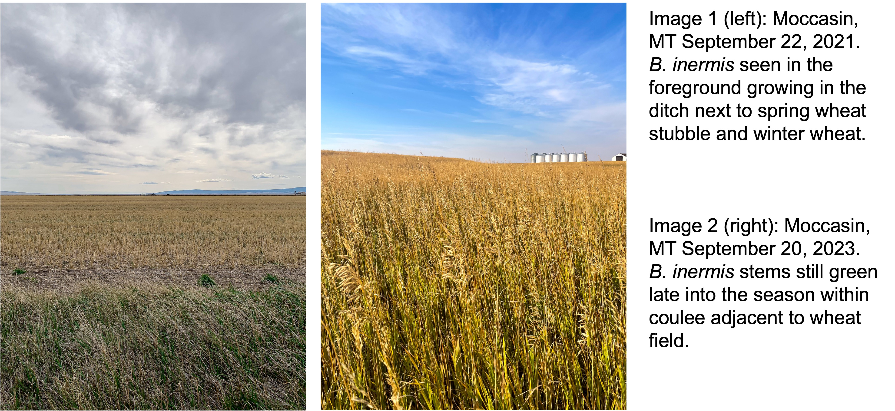

<div class="box">
This document can be downloaded as either a .docx or .pdf document. Please be aware that conversion may cause the formatting to be altered. 

<a href="convert/JacksonStrand_Paper%201.docx" target="_blank">Download .docx</a>  

<a href="convert/JacksonStrand_Paper%201.pdf" target="_blank">Download .pdf</a>

</div>

## Abstract

Wheat stem sawfly, *Cephus cinctus* Norton (WSS), causes significant damage in cereal crops throughout the Northern Great Plains of North America. Bracon cephi and Bracon lissogaster are native WSS parasitoids important in managing WSS outbreaks and damage. Smooth Brome (Bromus inermis) grass has been found to be an effective parasitoid sink, and potential trap crop, when grown in areas surrounding wheat fields in Montana. As climate changes continue to alter central and northern Montana, WSS will continue to cause immense damage to dry-land cereal crop yields. My study observes the utilization of smooth brome in providing year-over-year host refuge for Bracon spp. We measured the WSS larval survival rate within controlled smooth brome plots, observing a maximum end-of-year survival of 5.7%. We also collected stems from central and northern Montana where we measured the WSS infestation and parasitoid prevalence within cultivated wheat and adjacent smooth brome. Montana fields sites showed similar high year-end WSS larval mortality while showcasing high levels of parasitism. This research underlines the importance of providing a sustainable ecological buffer for WSS parasitoids as climate conditions continue to change.

## Introduction

Ecologists and farmers frequently hold divergent views regarding the importance of natural habitats within agricultural landscapes, a distinction often overlooked in ecological and conservation discourse [@Tscharntke2016]. While ecologists recognize the role of natural habitats such as field border vegetation in supporting biodiversity and providing potential ecosystem services like biological pest control, many farmers perceive these semi-arid habitat remnants as occupying valuable cropland or even as sources of pests. As such, documenting how pest and natural enemy populations interact with agricultural landscapes alongside semi-natural habitat buffers on the crop periphery is important in determining the degree of the services or disservices provided. 

Numerous polyphagous insect herbivores and their natural enemies rely on a variety of resources found across diverse habitat types within their environment. Depending upon the quality of the resource, different habitat types can serve as sources for increased pest or natural enemy populations. Similarly, these habitat types can serve as sinks that decrease populations [@Kennedy2000]. Altering the presence of these resources can have impacts on pest or natural enemy populations and can alter the ecology between the examined species. For example, diversifying the edge cropping of organic *Brassica* using fava beans, fennel, and marigolds results in a diversity in beneficial arthropod communities that help reduce phytophagous herbivory [@DeMorais2023]. 

Understanding the ways in which landscape habitat diversity impacts the ecological relationship between pest and enemy is crucial for effectively managing pest species in large scale cropping systems. Similarly, understanding how herbivore plant-hosts act as reservoirs for pests or beneficial natural enemies can potentially play a role in stabilizing year-over-year agricultural impact from these pests [@Cano2022]. 

The wheat stem sawfly (WSS), Hymenoptera *Cephus cinctus* Norton, is a grass-mining sawfly native to North America [@Criddle1922; Ainslie1929; @Wallace1966; @Lesieur2016]. Originally adept at utilizing wild grass hosts, the species became a major pest to cultivated cereals as this resource became more prevalent following European settlement, becoming a notable pest of winter wheat in 1990 in Montana [@Morrill1996], and more recently in Colorado [@Cockrell2021]. Climate warming has the potential to further expand the range of this pest both northward and southward [@Olfert2019; @Weaver2023]. Adult female WSS use their saw-like ovipositor to lay their eggs in the lumen of stems, where the eggs hatch, leading to larval feeding of parenchyma tissue [Roemhild1954; @Holmes1956]. Economic damage manifests in the form of both kernel weight reduction caused by tissue damage [@Beres2011a; Delaney2010] and stem toppling due to late-season larval girdling [@Holmes1960; @Nansen2005a; @McCullough2020]. 
  
Several parasitoid or predatory species attack *C. cinctus* within wild grass hosts [@Davis1955; @Morrill1998, @Morrill2001], however, two species, *Bracon cephis* (Gahan) and *Bracon lissogaster* Muesebeck (Hymenoptera: Braconidae), have been observed targeting WSS within cultivated cereals [@Nelson1953; @Morrill1998; @Runyon2001a; @Runyon2001b]. These two host-specific ectoparasitoids are native to North America. Both parasitoids are bivoltine, with the first generation present in Montana from late-June to late-July, while the second generation is active from mid-July to September [@Gahan1918; @Somsen1956; @Davis2013]. Adult female *B. cephi* and *B. lissogaster* inject a paralytic toxin into a *C. cinctus* larvae within the host stem, paralyzing the host larvae, and depositing from a single (*B. cephi*) to 1-3 (*B. lissogaster*) eggs. *B. cephi* and *B. lissogaster* have been shown to provide biological control via irreplaceable mortality of *C. cinctus* populations [@Buteler2015; @Peterson2011] and can significantly reduce *C. cinctus* damage and impact on crop yields [@Buteler2008; @Adhikari2019; @Bekkerman2018; @Rand2020]. While *C. cinctus* has a wide range of viable host plants, including native and non-native grasses and cultivated row-crops such as wheat (*Triticum aestivum L.*) and barley (*Hordeum vulgare*) [@Wallace1966; @Cockrell2017; @Achhami2020], infestation levels can vary widely across hosts. Previous research has shown preference for host plants with larger stem diameter [@Ainslie1920; @Buteler2009; @Bhandari2020]. 

Recent research has shown natural non-cultivated grasses such as *Agropyron cristatum*, *Bromus techtorum*, *Bromus inermis*, *Elymus trachycaulus*, and *Thinopyrum intermedium* host *C. cinctus* and most also host Bracon spp. parasitoids quite well [@Mendoza2006; @Peirce2021; @Rand2024]. We find investigating *B. inermis* holds the most potential, as it has been shown to be a quality initially-accepted host for *C. cinctus* oviposition while also leading to high larval mortality later on [@Seamans1928; @Farstad1945]. However, there is a lack of detailed relating to the total infestation, cutting, and parasitism within *B. inermis* at multiple time points throughout the growing season. Quantitative assessment of potential 'reservoir' characteristics and local spatial information could prove useful in fully understanding the ecological impacts of maintaining *B. inermis* along roadways and within coulees.  

Smooth brome (*Bromus inermis* Leyss) is a Eurasian cool-season rhizomatous grass introduced to the United States in 1884 [@Bolwahn2011].*B. inermis* was originally thought of as potentially useful as a trap crop in order to combat the growing WSS problem with cultural control practices [@Criddle1922; @Farstad1945; @Beres2011a]. Due to its low agricultural value, and propensity to form monocultures and out compete many native grasses, *B. inermis* is categorized as invasive in some habitats [@Carlson1985; @Willson2000; @Dillemuth2008]. However, *B. inermis* still holds considerable ecological and potential economic value due to its late senescence and WSS antibiosis properties [@Otfinowski2006; @Rand2024].

Montana's golden triangle, an area of central and northern Montana with intense cereal grain production, is prone to drought and burning via wildfire [@Wilson1923; @Adhikari2019]. As both *C. cinctus* and its host-specific parasitoids are relatively restricted in their annual mobility [@Weaver2005], environmental extremes can have broad impacts on both local pest and natural enemy populations. As with many predator-prey interactions, the *C. cinctus* and parasitoid populations fluctuate, with crashes and spikes experienced in close succession and through ineteraction with drought [@Holmes1963; @Holmes1982]. Similar examples of these classical population dynamics patterns can be found in wolves and moose on Isle Royale [@Peterson1999], and Coccinellidae and aphids [@Evans1999], among others. 

We examined historical weather data from two field locations (10 sites overall) in central and northern Montana. We used this data to understand how changes in global climate trends may be impacting *C. cinctus*, *B. cephi* and *B. lissogaster* interact with *B. inermis* populations. In addition we analyzed normalized difference vegetative index (NDVI) at our field sites to understand how *B. inermis* senescence patterns compare to adjacent cultivated wheat fields. 

In this study, we explored the ecological patterns between Montana populations of *C. cinctus* and its associated braconid parasitoids in relation to *B. inermis* host sites. Our goal, was 1) to understand the degree to which *C. cinctus* infested *B. inermis* stems in relation to neighboring cereal crops, and 2) the way in which braconid parasitoids utilized WSS hosts available within *B. inermis* stems. To do so, we conducted two separate studies. In our first study, we conducted controlled *C. cinctus* infestation of *B. inermis* to understand the relative infestation and cutting rate of *C. cinctus* within the *B. inermis* stems in the absence of parasitoids. The second study examined rates of cutting and parasitism in wheat crops and their surroundings at field sites in central and northern Montana. 

Using these studies, we addressed three questions, 1) what is the total *C. cinctus*-caused stem cutting heading into overwinter - and thus the source rate, of the subsequent *C. cinctus* population in *B. inermis*? 2) can *C. cinctus* larvae within *B. inermis* serve as critical second generation hosts for *B. cephi* and *B. lissogaster*? and 3) how do annual *C. cinctus* and parasitoid populations in *B. inermis* compare with those in the adjacent cultivated wheat fields?

## Materials and Methods

All data for experiments was analyzed using R Studio (R Studio version 2024.04.0+735, R 2024). 

### Weather data and NDVI analysis

*Weather data.* We assessed the medium- and long-term temperature and precipitation trends of our field sites using weather data from the National Oceanic and Atmospheric Administration (NOAA, Silver Spring, MA, USA). Data for each field site was averaged from three of the closest weather stations to that location. Data was plotted using R package 'ggplot' (version 3.4.4) [@ggplot]. Data was then fit using a linear model using the 'lm' command using average yearly precipitation (inches) as the response variable and year as the predictor.

*NDVI analysis.* We compared the relative greening throughout the growing season between wheat fields and adjacent *B. inermis* using the normalized difference vegetation index (NDVI). NDVI is typically used to assess vegetation health and density, and is calculated from the visible and near-infrared light reflected by vegetation [@Pettorelli2005]. NDVI data measurements were directly downloaded using Google Earth Engine (Google Inc. 2023, Mountain View, CA, USA). Similar to our weather data analysis, NDVI data was modeled using the linear modeling package 'lm' in R to discern differences in NDVI measurments over time. 

### Controlled *C. cinctus* infestation of *B. inermis*

*Insects and Cages.* Assessment of *C. cinctus* infestation and mortality within *B. inermis* were assessed using a 34 x 60 ft plot at the Arthur H. Post Agronomy Farm (43°38'19.39"N, 116°14'28.86"W), an experimental farm of Montana State University in Bozeman, MT. There is a negligible population of *C. cinctus* and associated parasitoids at this location. Experimental cages  were built using 1-inch PVC piping with the netting made using 530$\mu$ Amber Lumite Screen (BioQuip$^\circledR$ Products, LLC). Twelve cages were built to dimensions of 6ft x 3ft x 3ft (L x W x H) with cage locations selected randomly based on the space available within the plot and arranged in sets of three.

Wheat stem stubble was collected in Three Forks, MT, USA (43°38'19.39"N, 116°14'28.86"W) from fields that experienced high levels of *C. cinctus* infestation and cutting the year prior, as previously described [@Hager2024]. Cut stubble, which contained *C. cinctus* larvae in diapause, were kept refrigerated between -2°C and 3°C for \>100 days as required to complete obligatory larval diapause. As needed, stubs were removed from refrigeration and kept at 22-27°C for 4-5 weeks inside of 100 oz GladWare® storage containers (Glad®, Oakland, California USA). Once *B. inermis* stems reached six inches tall, stub containers with emerging sawflies were added to cages to mimic sawfly infestation pressure. Sawfly quantity treatments were as follows: high (600 stubs), low (200 stubs), and control (0 stubs).

*Data Collection.* In late August, *B. inermis* stems were collected from each cage. Each stem was sliced open using X-Acto® knives to collect data on infestation, dead larvae and live larvae, as well as very rare parasitism events, for each internode.

### Montana Field Survey

*Stem collection and processing.* We conducted a field survey to assess *C. cinctus* infestation, larval mortality, and *B. cephi* and *B. lissogaster* prevalence within *B. inermis* and adjacent wheat fields. Sites were chosen across 2 counties in north-central Montana, United States. (Chouteau, Judith Basin), which consistently experience high *C. cinctus* pressure. Samples were collected from wheat fields and adjacent *B. inermis* in early July and late August in 2022, and 2023 from sites in Big Sandy and Moccasin MT, USA. Sampling sites were set up as 100$m^2$ polygons along the edge of adjoining wheat fields. Four collection squares of 1ft x 1ft were randomly selected within each polygon during both collection events each year. All stems within each 1 x 1 ft square were collected using a shovel to remove both stem and root material. Wheat stems were collected at distances of 5 and 20 meters from the edge of the field. Samples were collected in 4 rows at 10 meters apart. 2 samples were collected in each row at distances of 5 and 20 meters. 1 ft samples were collected at each point.

Wheat and *B. inermis* stems were then returned to Montana State University, Bozeman, Montana and stored in a 10°C cold, humid storage until dissection. Stems were dissected in the same manner as samples from our controlled experiment. We recorded presence or absence of *C. cinctus* larval infestation, live eggs, dead eggs, dead larvae, live larvae and parasitism, in addition to stem cutting. Sawfly larvae were identified based on descriptions in Criddle (1915) and Wallace and McNeal (1996).

*Statistical Analysis.* We used generalized linear mixed models with binomial errors (logit link) fit using bound optimization by quadratic approximation, with a maximum of 200,000 iterations, were run in the *lme4* package in R [@lme4] to examine the effects of location and year (fixed effects) on each of the three response variables: proportion of stems infested, proportion of stems cut, and proportion of stems parasitized by *Bracon* spp. 

To better understand the densities of host *C. cinctus* and the *Bracon* spp. within the wheat and adjacent *B. inermis* at each sampling site, we converted our units to the ratio of parasitoids to surviving hosts stem per unit area. Densities of stems are different when considering semi-natural, long-standing stands of *B. inermis* and the adjacent cultivated wheat or barley. 

## Results

```{r setup1, include=FALSE}
knitr::opts_chunk$set(
  warning = FALSE,
  message = FALSE,
  echo = FALSE
)
```

```{r libraries}
library(markdown)
library(tidyverse)
library(glue)
library(lubridate)
library(ggplot2)
library(maps)
library(readxl)
library(kableExtra)
library(openxlsx)
library(lme4)
```

### Historical Weather Analysis & NDVI

```{r moc_weather}

# moccasin NOAA
moc_weather_noaa <-
read_excel("weather/moccasin_weather_noaa.xlsx") %>%
  filter(station == "USW00024036") %>%
  dplyr::select(date, variable, value, year) %>%
  mutate(date = ymd(date))

# moccasin prcp MAES
moc_prcp_maes <-
  read_excel("weather/moc_weather_maes.xlsx",
             sheet = "prcp") %>%
    dplyr::select(-1, -Annual, -Seasonal) %>%
    pivot_longer(-Year,
                 names_to = "month",
                 values_to = "prcp") %>%
    mutate(Year = lubridate::year(as.Date(Year, format = "%Y"))) %>%
    rename("year" = Year) %>%
    group_by(year) %>%
    reframe(prcp = sum(prcp)) 
  
# moccasin temp MAES
moc_temp_maes <-
  read_excel("weather/moc_weather_maes.xlsx",
             sheet = "temp") %>%
    dplyr::select(-1, -Annual, -Seasonal) %>%
    pivot_longer(-Year,
                 names_to = "month",
                 values_to = "temp") %>%
    mutate(Year = lubridate::year(as.Date(Year, format = "%Y"))) %>%
    rename("year" = Year) %>%
    group_by(year) %>%
    reframe(temp = mean(temp)) 

# past 50 years prcp data
moc_prcp_50 <-
moc_prcp_maes %>%
  filter(year > 1975)

# past 50 years temp data
moc_temp_50 <-
  moc_temp_maes %>%
  filter(year > 1975)
```

```{r bs_weather}
# big sandy
bs_weather <-
read_excel("weather/bigsandy_weather_noaa.xlsx") %>%
  filter(station == "USC00240770") %>%
  dplyr::select(date, variable, value, year, station) %>%
  mutate(date = ymd(date))

# past 50 years prcp data
bs_prcp_50 <-
bs_weather %>%
  filter(variable == "PRCP") %>%
  group_by(year) %>%
  reframe(prcp = mean(value)) %>%
  distinct() %>%
  filter(year > 1975,
         year < 2024,
         prcp < 25)

bs_temp_noaa <-
bs_weather %>%
  filter(variable %in% c("TMAX", "TMIN"),
         value < 100,
         value > -30) %>%
  pivot_wider(names_from = "variable",
              values_from = "value") %>%
  na.omit() %>%
  group_by(date, station) %>%
  mutate(daily = (TMAX - TMIN)/2) %>%
  mutate(month = month(date)) %>%
  # filter(month > 3,
  #       month < 9) %>%
  group_by(year, station) %>%
  reframe(temp = mean(daily)) 

```

```{r both_prcp}
both_locations_prcp <-
bs_prcp_50 %>%
  mutate(location = "Big Sandy") %>%
  rbind(moc_prcp_50 %>%
          mutate(location = "Moccasin"))

both_prcp_lm <-
both_locations_prcp %>%
  filter(location == "Big Sandy") %>%
  lm(prcp ~ year, data = .) %>%
  summary()

moc_50_lm <-
  moc_prcp_50 %>%
  lm(prcp ~ year, data = .) %>%
  summary()

bs_50_lm <-
  bs_prcp_50 %>%
  lm(prcp ~ year, data = .) %>%
  summary()

calculate_segment <- function(model) {
  intercept <- model$coefficients[1, 1]
  slope <- model$coefficients[2, 1]
  segment_formula <- function(x) intercept + slope * x
  x_start <- 1975
  x_end <- 2024
  y_start <- segment_formula(x_start)
  y_end <- segment_formula(x_end)
  segment_data <- data.frame(x_start, y_start, x_end, y_end)
  return(segment_data)
}

bs_segment <- calculate_segment(bs_50_lm)
moc_segment <- calculate_segment(moc_50_lm)

both_prcp_plot <-
both_locations_prcp %>%
  ggplot() +
  theme_bw() +
  geom_segment(data = bs_segment,
               aes(x = x_start, 
                   y = y_start,
                   xend = x_end, 
                   yend = y_end),
               color = "#F8766D",
               alpha = 0.5) +
  geom_segment(data = moc_segment,
               aes(x = x_start, 
                   y = y_start,
                   xend = x_end, 
                   yend = y_end),
               color = "#00BFC4",
               alpha = 0.5) +
  geom_line(aes(x = year, y = prcp, color = location),
            size = 0.3) +
  geom_smooth(aes(x = year, y = prcp),
              method = "lm",
              se = FALSE,
              color = "black",
              size = 0.5,
              alpha = 0.2) +
  labs(color = "Location (MT, USA)",
       x = NULL,
       y = "Average Yearly Precipitation (in)")
```

```{r both_temp}
both_temp <-
moc_temp_maes %>%
  mutate(location = "Moccasin") %>%
  bind_rows(bs_temp_noaa %>%
              select(-station) %>%
              mutate(location = "Big Sandy") %>%
              filter(temp < 50)) %>%
  mutate(temp = ifelse(location == "Big Sandy",
                       (temp - 32) * (5/9) * -1 + 10,
                       (temp - 32) * (5/9))) %>%
  filter(year > 1950)

both_temp_plot <-
both_temp %>%
  na.omit() %>%
  ggplot() +
  geom_line(aes(x = year, y = temp, color = location),
            alpha = 0.5) +
  geom_smooth(aes(x = year, y = temp),
              method = "lm",
              se = FALSE,
              color = "black") +
  geom_smooth(aes(x = year, y = temp, color = location),
              method = "lm",
              se = FALSE,
              size = 0.3) +
  theme_bw() +
  labs(color = "Location (MT, USA)",
       x = NULL,
       y = "Mean Yearly Temperature (°C)")

# lm both
both_temp_lm <-
both_temp %>%
  lm(temp ~ year + location, data = .) %>%
  summary()

```

```{r save temp, echo = F}
calculate_segment <- function(model) {
  intercept <- model$coefficients[1, 1]
  slope <- model$coefficients[2, 1]
  segment_formula <- function(x) intercept + slope * x
  x_start <- 1975
  x_end <- 2024
  y_start <- segment_formula(x_start)
  y_end <- segment_formula(x_end)
  segment_data <- data.frame(x_start, y_start, x_end, y_end)
  return(segment_data)
}

# moc_segment <- calculate_segment(moc_lm)

moc_temp_plot <-
moc_temp_maes %>%
  ggplot() +
  theme_bw() +
  geom_line(aes(x = year, y = ((temp - 32) * (5/9))),
            size = 0.4) + 
  geom_smooth(aes(x = year, y = ((temp - 32) * (5/9))),
              method = "lm",
              se = FALSE,
              size = 0.5,
              alpha = 0.2) +
  labs(color = "Location (MT, USA)",
       x = NULL,
       y = "Average Yearly Temperature (°C)")

```


We observed a significant linear relationship (*r = `r round(both_prcp_lm$r.squared,3)`, P = `r round(both_prcp_lm$coefficients[2,4],3)`, estimate = `r round(both_prcp_lm$coefficients[2,1],3)`*) between average precipitation and year for both Big Sandy and Moccasin, Montana. For each location and one-year increase, we observed a 0.05 inch decrease in precipitation. ([Fig. 1](#figure1)). Additionally, we observed a significant positive linear relationship (*r = `r round(both_temp_lm$r.squared,3)`, P \< 0.05, estimate = `r round(both_temp_lm$coefficients[2,1],3)`*) between year and average yearly temperature for Moccasin and Big Sandy, MT. Thus, each year, the average daily temperature has increased by `r round(both_temp_lm$coefficients[2,1],2)`°C. ([Fig. 2](#figure2)).

```{r Big_Sandy_NDVI}
lochy <-
read_excel("ndvi/ndvi_2023.xlsx", sheet = "lochy") %>%
  filter(use == "yes") %>%
  mutate(date = ymd(date1)) %>%
  dplyr::select(date,wheat,brome) %>%
  pivot_longer(-date,
               names_to = "plant_type",
               values_to = "ndvi") 
ndvi_model <-
lochy %>%
  filter(date > "2023-07-15") %>%
  lm(ndvi ~ plant_type + date, data = .) %>%
  summary()


label_x <- as.Date("2023-07-20")
label_y <- 0.75
line_x <- as.numeric(as.Date("2023-07-20"))

bs_ndvi_plot <-
lochy %>%
  ggplot() +
  geom_point(aes(x = date, y = ndvi, color = plant_type),
             alpha = 0.5,
             pch = 1,
             size = 0.75) +
  geom_line(aes(x = date, y = ndvi, color = plant_type, linetype = plant_type),
            alpha = 0.5,
            size = 0.5) +
  geom_smooth(aes(x = date, y = ndvi, color = plant_type),
              se = FALSE) +
  geom_vline(xintercept = line_x,
             linetype = "dashed", color = "black") +
  geom_label(aes(x = label_x,
                 y = 0.75),
             label = "Spring wheat harvest",
             hjust = -0.1,
             size = 3) +
  geom_segment(aes(x = as.Date("2023-07-20")+5, 
                   y = 0.75, 
                   xend = as.Date("2023-07-20"), 
                   yend = 0.75)) +
  theme_bw() +
  guides(color = FALSE) +
  labs(x = "2023 Growing Season",
       y = "NDVI",
       linetype = NULL) +
  scale_linetype_discrete(labels = c(expression(italic("B. inermis")),
                                                      "Spring Wheat"))
```

We observed a notable difference in NDVI when comparing adjacent *B. inermis* and spring wheat. We saw a significant difference in the July NDVI (*`r round(ndvi_model$r.squared,3)`, P \< 0.05*). The *B. inermis* NDVI remained relatively linear in it's downslope (BROME SLOPE POST JULY) compared to the wheat field (WHEAT FIELD POST JULY). ([Fig. 3](#figure3))

Need to add map showing where NDVI measurements came from

### Controlled *C. cinctus* Infestation of *B. inermis*

```{r column.order}
column.order <- c("distance", "collection", "p.inf", 
                  "p.cut", "p.par", "poten")

column.order2 <- c("location", "distance", "collection", "p.inf", 
                  "p.cut", "p.par", "poten")

round_based_on_size <- function(x) {
  threshold <- 0.01
  rounded_values <- ifelse(abs(x) > threshold, round(x, 2), round(x, 3))
  return(rounded_values)
}
```

```{r (pf.RAW) post farm n.inf data}
pf.raw.2022 <- read_excel("/Users/jacksonstrand/Library/CloudStorage/OneDrive-MontanaStateUniversity/Data/BWW/Field/Post\ Farm/2022/Post\ Farm\ 2022.xlsx", sheet = "n.inf")
pf.raw.2023 <- read_excel("/Users/jacksonstrand/Library/CloudStorage/OneDrive-MontanaStateUniversity/Data/BWW/Field/Post\ Farm/2023/Post\ Farm\ 2023.xlsx", sheet = "n.inf")
```

```{r (pf.inf.23) post farm inf data}
pf.inf.23 <- read_excel("/Users/jacksonstrand/Library/CloudStorage/OneDrive-MontanaStateUniversity/Data/BWW/Field/Post\ Farm/2023/Post\ Farm\ 2023.xlsx", sheet = "inf") %>%
  rename(n.1 = 8, n.2 = 9, n.3 = 10, n.4 = 11,
         n.5 = 12, n.6 = 13, n.7 = 14, n.8 = 15,
         n.9 = 16, n.10 = 17)
```

```{r (pf.comb) post farm data combined}
# 2022
pf.2022.site <-
pf.raw.2022 %>%
  group_by(treatment, site) %>%
  reframe(site, treatment,
            p.inf = sum(iv, ir, ix)/sum(uv, ur, iv, ir, ix),
            cut = sum(cut)/sum(total),
            total.stems = sum(iv, ir, ix, uv, ur)) %>%
  unique() %>%
  pivot_longer(-c(treatment, total.stems, site),
               names_to = "type",
               values_to = "percent") %>%
  mutate(year = "2022")

# 2023
pf.2023.site <-
pf.raw.2023 %>%
  group_by(treatment, site) %>%
  reframe(treatment, site, 
          t.inf = sum(n.iv, n.ir, n.ix),
          p.inf = sum(n.iv, n.ir, n.ix)/sum(n.uv, n.ur, 
                                            n.iv, n.ir, n.ix),
          cut = sum(cut)/sum(total),
          total.stems = sum(n.iv, n.ir, n.ix, n.uv, n.ur)) %>%
  distinct() %>%
  pivot_longer(-c(treatment, total.stems, site),
               names_to = "type",
               values_to = "percent") %>%
  filter(!type == "t.inf") %>%
  arrange(type) %>%
  mutate(year = "2023")

pf.comb <-
  pf.2022.site %>%
  rbind(pf.2023.site) %>%
  group_by(treatment, year, type) %>%
  mutate(count = n(),
         average = mean(percent),
         sd = sd(percent),
         se = (sd/sqrt(count))) %>%
  reframe(treatment, year, type,
          mean = mean(percent),
          sd = mean(sd),
          se = mean(se)) %>%
  unique()


```

```{r (pf.total) pf total stems}
# 2022 totals
pf.2022.total <-
  pf.raw.2022 %>%
  group_by(treatment) %>%
  reframe(total = sum(uv, ur, iv, ir, ix)) %>%
  mutate(year = "2022")
  
# 2023 totals
pf.2023.total <-
  pf.raw.2023 %>%
  group_by(treatment) %>%
  reframe(total = sum(n.uv, n.ur, n.iv, n.ir, n.ix)) %>%
  mutate(year = "2023")

pf.total.comb <-
  pf.2022.total %>%
  rbind(pf.2023.total)

```

```{r pf_lm}
raw.23 <-
pf.raw.2023 %>%
  dplyr::select(site, treatment,
                n.iv, n.ir, n.ix, n.ur, n.uv,
                cut) %>%
  rename(iv = n.iv,
         ir = n.ir,
         ur = n.ur,
         ix = n.ix,
         uv = n.uv) %>%
  mutate(year = 2023)

raw.22 <-
pf.raw.2022 %>%
  dplyr::select(site, treatment, 
                ix, ir, iv, ur, uv,
                cut) %>%
  mutate(year = 2022)

pf_inf_lm <-
raw.23 %>%
  rbind(raw.22) %>%
  group_by(site, treatment, year) %>%
  reframe(total = sum(iv, ir, ix, ur, uv),
          inf = sum(iv, ir, ix)) %>%
  lm(inf ~ treatment + year, data = .) %>%
  summary()

pf_cut_lm <-
raw.23 %>%
  rbind(raw.22) %>%
  group_by(site, treatment, year) %>%
  reframe(total = sum(iv, ir, ix, ur, uv),
          inf = sum(iv, ir, ix),
          cut = sum(cut)) %>%
  lm(cut ~ treatment + year, data = .) %>%
  summary()
```

```{r pf_per, eval = F}
raw.23 %>%
  rbind(raw.22) %>%
  group_by(treatment) %>%
  reframe(total = sum(iv, ir, ix, ur, uv),
          inf = sum(iv, ir, ix),
          cut = sum(cut),
          p.inf = inf/total,
          p.cut = cut/inf)
```

Initially, *C. cinctus* heavily infested stems of *B. inermis* in the controlled test conditions. Averaged across both years, we observed 66.5% of stems infested for high treatments and 47.3% of stems for low treatments. We found strong evidence suggesting that there was a significant difference between infestation at high and low treatment levels when holding year constant (*r = `r round(pf_inf_lm$r.squared,3)`, P \< 0.05*, [Fig. 3](#figure4)).

```{r fig4_inf_cut_plot code}
pf.comb.hl <-
pf.comb %>%
  filter(!treatment == "control")

inf_cut_plot <-
ggplot() +
  facet_wrap(~treatment) +
  geom_bar(stat = "identity",
           position = position_dodge(),
           data = pf.comb.hl %>%
             filter(type == "p.inf"),
           aes(year, mean, fill = "p.inf")) +
  geom_bar(stat = "identity",
           position = position_dodge(),
           data = pf.comb.hl %>%
             filter(type == "cut"),
           aes(year, mean, fill = "cut")) +
  geom_errorbar(data = pf.comb.hl,
                aes(x = year,
                    ymin = mean - se,
                    ymax = mean + se),
                position = position_dodge(0.9),
                width = 0.2,
                alpha = 0.5) +
  theme_bw() +
  labs(x = element_blank(),
       y = "Percentage of stems (%)",
       fill = element_blank()) +
  scale_fill_brewer(palette = "Greys",
                    labels = c("Cut", "Infested"))
```

Stem cutting by mature larvae, leading into winter, was observed at 5.7% for the high treatments and 3.9% for the low, showing strong evidence for a difference in cutting between high and low treatment groups (*r = `r round(pf_cut_lm$r.squared,3)`, P < 0.05*). There was a dramatic decrease in survival observed from initial infestation to stem cutting. 

```{r figure_5_pf_inf_nodes}
pf.y.2022 <- read_excel("/Users/jacksonstrand/Library/CloudStorage/OneDrive-MontanaStateUniversity/Data/BWW/Field/Post\ Farm/2023/Post\ Farm\ 2022.xlsx", sheet = "inf")
pf.y.2023 <- read_excel("/Users/jacksonstrand/Library/CloudStorage/OneDrive-MontanaStateUniversity/Data/BWW/Field/Post\ Farm/2023/Post\ Farm\ 2023.xlsx", sheet = "inf")

# DATA FOR THE PLOT
pf.nodes.plot.data <-
pf.y.2023 %>%
  dplyr::select(-c(Name, 'Date Proc')) %>%
  dplyr::select(treatment, 6:15) %>%
  pivot_longer(-c(treatment),
               names_to = "node",
               values_to = "value") %>%
  mutate(node = gsub("n_", "", node)) %>%
  na.omit() %>%
  mutate(year = "2023") %>%
  rbind(pf.y.2022 %>%
          dplyr::select(-c(site1, site2, site12, site3,
                           Name, 'Date Proc')) %>%
          dplyr::select(treatment, 
                        2, 3, 4, 5, 6, 
                        7, 8, 9, 10, 11) %>%
          pivot_longer(-c(treatment),
                       names_to = "node",
                       values_to = "value") %>%
          na.omit() %>%
          mutate(year = "2022")) %>%
  group_by(year, treatment, node) %>%
  reframe(count = n()) %>%
  group_by(year, treatment) %>%
  mutate(per = count/sum(count)) %>%
  mutate(node = as.numeric(node)) 

# PLOT
pf_nodes_plot <-
  pf.nodes.plot.data %>%
  ggplot() +
  geom_bar(stat = 'identity',
           aes(x = node, y = per, fill = treatment),
           position = position_dodge(),
           color = "black") +
  theme_bw() +
  scale_fill_brewer(palette = "Greys") +
  scale_x_continuous(breaks = 1:10) +
  labs(x = "Stem Internode",
       y = "Percent of internodes infested") +
  facet_wrap(~year) 

pf_nodes_over_4_table <-
pf.nodes.plot.data %>%
  group_by(year, node) %>%
  reframe(count = sum(count)) %>%
  group_by(year) %>%
  mutate(per = count/sum(count)) %>%
  filter(node > 4) %>%
  group_by(year) %>%
  reframe(sum = sum(per))
```

*C. cinctus* infested stems often contained larvae burrowing through multiple nodes. In 2022, `r round(pf_nodes_over_4_table[1,2],3)*100`% of stems were observed to have at least 4 nodes burrowed through, or 5 internodes occupied. In 2023, `r round(pf_nodes_over_4_table[2,2],3)*100`% of stems had at least 4 nodes infested [Fig. 5](#figure5)


### Montana Field Sites

```{r stubble data}
# stubble 2023
stubble.2023 <-
  read_excel("/Users/jacksonstrand/Library/CloudStorage/OneDrive-MontanaStateUniversity/Data/BWW/Field/field Sites/2023/2023\ Field Site\ Data.xlsx", 
           sheet = "stubble") %>%
  dplyr::select(-c(name,date.proc,"%inf", "%cut")) %>%
  na.omit() %>%
  mutate(year = "2023") 

# stubble 2022
stubble.2022 <-
  read_excel("/Users/jacksonstrand/Library/CloudStorage/OneDrive-MontanaStateUniversity/Data/BWW/Field/field Sites/2022/2022 FS Stem Data (2).xlsx", 
             sheet = "stubble") %>%
  mutate(year = "2022") %>%
  dplyr::select(-c(name, date.proc, "%inf", "%cut"))

comb.stubble <-
stubble.2023 %>%
  rbind(stubble.2022) %>%
  rename("c" = cocoon,
         "e" = eh,
         "total.stems" = total) %>%
  group_by(site, year, collection) %>%
  mutate(inf = sum(cut, inf.nc,c,e)) %>%
  dplyr::select(-c(inf.nc, larvae)) 
```

```{r brome data}
# brome 2022
raw.2022 <- 
  read_excel("/Users/jacksonstrand/Library/CloudStorage/OneDrive-MontanaStateUniversity/Data/BWW/Field/field Sites/2022/2022 FS Stem Data (2).xlsx", sheet = "n.infested") %>%
  mutate(year = "2022") %>%
  dplyr::select(-c(other, date.proc, name, 
                   par.rate, cut.rate, inf)) %>%
  rename("site" = site.cap)

# brome 2023
raw.2023 <-
read_excel("/Users/jacksonstrand/Library/CloudStorage/OneDrive-MontanaStateUniversity/Data/BWW/Field/field Sites/2023/2023\ Field Site\ Data.xlsx", sheet = "n.infested") %>%
  mutate(year = "2023") %>%
  dplyr::select(-c(loc.stub, date.proc, uv, ur, iv, ir, ix, 
                   total.stems, add, inf, a)) %>%
    rename(uv = n.uv,
           ur = n.ur,
           iv = n.iv,
           ir = n.ir,
           ix = n.ix,
           total.stems = n.total)
# combine brome years
comb.brome <- 
raw.2023 %>%
  rbind(raw.2022) %>%
  group_by(site, year, collection) %>%
  mutate(inf = sum(iv, ir, ix),
         uninf = sum(uv, ur),
         cut = sum(cut)) %>%
  dplyr::select(-c(iv, ir, ix, uv, ur)) %>%
  mutate(distance = "brome")
```

We quantified *C. cinctus* and *Bracon* spp. parasitoid presence in 6,148 wheat and grass stems across 10 research sites in 2022 and 2023. Initial infestation of *B. inermis* by *C. cinctus* varied between collection sites, with the greatest infestation taking place within our three Big Sandy, MT sampling sites (2023: 65.4%, 2022: 63.1%), while the lowest infestation observed was in Moccasin, MT (2023: 40.8%, 2022: 60.7%). Across all sites in Big Sandy and Moccasin, we observed an average infestation of 57.5% within *B. inermis* and 47.6% within the adjacent wheat. Cutting by *C. cintus* was observed at an average rate of 5.59% (se = 0.02) in *B. inermis* and 47.1% (se = 0.04) in the adjacent cultivated wheat ([Fig. 7](#figure7). 

To generate a relative estimate of the number of available *C. cinctus* host larvae within *B. inermis* late in the growing season, we calculated the number of stems that contained at least four or more nodes with burrowing injury. In Big Sandy, 76.2% of collected stems in the fall exhibited at least 4 nodes of burrowing injury at our second sampling date. In Moccasin, the corresponding figure was 66.5%.

```{r y_inf_brome}
brome_inf_2023 <-
read_excel("/Users/jacksonstrand/Library/CloudStorage/OneDrive-MontanaStateUniversity/Data/BWW/Field/field Sites/2023/2023\ Field Site\ Data.xlsx", sheet = "y.infested") %>%
  dplyr::select(-c("date.proc")) %>%
  mutate(year = "2023")

brome_inf_2022 <-
  read_excel("/Users/jacksonstrand/Library/CloudStorage/OneDrive-MontanaStateUniversity/Data/BWW/Field/field Sites/2022/2022 FS Stem Data (2).xlsx", sheet = "y.infested") %>%
  dplyr::select(-c("old name", "name", "date.proc", "cut")) %>%
  mutate(year = "2022")
```

```{r per_nodes_inf}
internode.data <-
brome_inf_2023 %>%
  rbind(brome_inf_2022) %>%
  mutate(row_num = row_number()) %>%
  mutate(sample_site = case_when(
    location %in% c("nn", "ss", "ns", "n") ~ "North Road",
    location %in% c("kw", "ke", "k") ~ "Kolin Road",
    location %in% c("sun", "har") ~ "Sunset & Harvest",
    location == "g" ~ "Gardiner Road",
    TRUE ~ NA_character_)) %>%
  mutate(region = case_when(
    location %in% c("nn", "ss", "ns", "n") ~ "Big Sandy",
    location == "g" ~ "Big Sandy",
    location %in% c("kw", "ke", "k") ~ "Moccasin",
    location %in% c("sun", "har") ~ "Moccasin",
    TRUE ~ NA_character_)) %>%
  dplyr::select(-location) %>%
  mutate(row_num = row_number()) %>%
  pivot_longer(-c(year, site, sample_site, region, 
                  collection, lar, v.r, row_num),
               names_to = "node",
               values_to = "status") 
brome.nodes <-
internode.data %>%
  group_by(region, collection,
           node) %>%
  na.omit() %>%
  reframe(count = n()) %>%
  mutate(node = as.numeric(node)) %>%
  group_by(region, collection) %>%
  mutate(per = count/sum(count)) %>%
  ggplot() +
  geom_bar(stat = "identity",
           aes(x = node, y = per, fill = collection),
           position = position_dodge(),
           color = "black") +
  facet_wrap(~region) +
  scale_x_continuous(breaks = 1:10) +
  theme_bw() +
  scale_fill_brewer(palette = "Greys") +
  labs(x = "Stem Internode",
       y = "Percentage of nodes infested",
       fill = "Collection")

```

```{r plot_data}
plot.data <-
comb.brome %>%
  rbind(comb.stubble) %>%
  na.omit() %>%
  filter(!location %in% c("chs", "b")) %>%
  mutate(sample_site = case_when(
    location %in% c("nn", "ss", "ns", "n") ~ "North Road",
    location %in% c("kw", "ke", "k") ~ "Kolin Road",
    location %in% c("sun", "har") ~ "Sunset & Harvest",
    location == "g" ~ "Gardiner Road",
    TRUE ~ NA_character_)) %>%
  mutate(region = case_when(
    location %in% c("nn", "ss", "ns", "n") ~ "Big Sandy",
    location == "g" ~ "Big Sandy",
    location %in% c("kw", "ke", "k") ~ "Moccasin",
    location %in% c("sun", "har") ~ "Moccasin",
    TRUE ~ NA_character_)) %>%
  mutate(plant_type = if_else(distance == "brome", "brome", "wheat")) %>%
  dplyr::select(year, region, sample_site, collection, plant_type,
                total.stems, inf, uninf, cut, c, e) %>%
  group_by(site, collection, year) %>%
  mutate(par = sum(c,e)) %>% dplyr::select(-c(c,e)) %>%
  group_by(year, collection, region, sample_site, plant_type, site) %>%
  mutate(count = n()) %>%
  ungroup() %>%
  dplyr::select(-c(uninf)) %>%
  group_by(year, collection, region, sample_site, plant_type, site) %>%
  mutate(total.stems = sum(total.stems),
         count = sum(count),
         per.inf = inf/total.stems,
         per.par = par/inf,
         per.cut = cut/inf) %>%
  distinct() %>%
  pivot_longer(-c(year, collection, region, sample_site, 
                  plant_type, count, total.stems, site, inf, cut, par),
               names_to = "variable",
               values_to = "value") %>%
  dplyr::select(-site) %>%
  group_by(year, collection, region, sample_site, plant_type) %>%
  mutate(total.stems = sum(total.stems),
         count = sum(count),
         inf = sum(inf),
         cut = sum(cut),
         par = sum(par)) %>%
  group_by(year, collection, region, sample_site, plant_type, variable) %>%
  mutate(sd = sd(value),
         value = mean(value),
         se = sd/sqrt(count)) %>%
  ungroup() %>%
  dplyr::select(-site) %>%
  distinct() 

```

```{r fig_9_brome_par_plot}
brome_par_plot <-
plot.data %>%
  filter(
         plant_type == "brome",
         variable == "per.par") %>%
  mutate(collection = factor(collection, levels = c("summer", "fall"))) %>%
  ggplot() +
  geom_bar(stat = "identity",
           aes(x = sample_site, y = value, fill = collection),
           position = position_dodge(),
           width = 0.5,
           color = "black") +
  geom_errorbar(aes(x = sample_site,
                    group = collection,
                    ymin = value - se,
                    ymax = value + se),
                position = position_dodge(width = 0.5),
                width = 0.15) +
  theme_bw() +
  labs(x = NULL) +
  scale_fill_brewer(palette = "Greys") +
  facet_wrap(year~region, scales = "free_x")
```

```{r brome_par_model}
brome_par_model_data <-
comb.brome %>%
  rbind(comb.stubble) %>%
  na.omit() %>%
  filter(!location %in% c("chs", "b")) %>%
  mutate(sample_site = case_when(
    location %in% c("nn", "ss", "ns", "n") ~ "North Road",
    location %in% c("kw", "ke", "k") ~ "Kolin Road",
    location %in% c("sun", "har") ~ "Sunset & Harvest",
    location == "g" ~ "Gardiner Road",
    TRUE ~ NA_character_)) %>%
  mutate(region = case_when(
    location %in% c("nn", "ss", "ns", "n") ~ "Big Sandy",
    location == "g" ~ "Big Sandy",
    location %in% c("kw", "ke", "k") ~ "Moccasin",
    location %in% c("sun", "har") ~ "Moccasin",
    TRUE ~ NA_character_)) %>%
  mutate(plant_type = if_else(distance == "brome", "brome", "wheat")) %>%
  dplyr::select(year, region, sample_site, collection, plant_type,
                total.stems, inf, uninf, cut, c, e) %>%
  group_by(site, collection, year) %>%
  mutate(par = sum(c,e)) %>% dplyr::select(-c(c,e)) %>%
  group_by(year, collection, region, sample_site, plant_type, site) %>%
  mutate(count = n()) %>%
  ungroup() %>%
  dplyr::select(-c(uninf)) %>%
  group_by(year, collection, region, sample_site, plant_type, site)

brome_par_model <-
brome_par_model_data %>%
  filter(plant_type == "brome") %>%
  lm(par ~ year + region + collection, data = .) %>%
  summary()


```


```{r infestation_per, eval = F}
comb.brome %>%
  group_by(location, collection, year) %>%
  # filter(collection == "fall") %>%
  reframe(inf = sum(inf)/sum(total.stems)) %>%
  distinct() %>%
  mutate(region = if_else(location %in% c("har", "sun", "k", "chs"), "moccasin", "big sandy")) %>%
  group_by(collection, year, region) %>%
  reframe(inf = mean(inf)) %>%
  na.omit() %>%
  arrange(desc(inf))
```

```{r paraistism_per, eval = F}
plot.data %>%
  filter(collection == "fall",
         year == "2023") %>%
  ggplot() +
  geom_bar(stat = "identity",
           aes(x = variable, y = value, fill = plant_type),
           position = position_dodge(width = 0.5),
           width = 0.5) +
  geom_errorbar(aes(x = variable, fill = plant_type,
                    ymin = value - se,
                    ymax = value + se),
                position = position_dodge(width = 0.5),
                width = 0.2) +
  facet_wrap(sample_site~region) +
  theme_bw() +
  scale_fill_brewer(palette = "Greys") +
  labs(x = NULL,
       y = "Percentage (%)")


mutate(type2 = if_else(
    type %in% c("p_mean", "p_sd", "p_se"), "p", "cut"),
    stat = str_replace(type, ".*_", "")) %>%
  dplyr::select(-type) %>%
  pivot_wider(values_from = value,
              names_from = stat) %>%
  filter(region == "Big Sandy")

plot.data %>%
  ggplot() +
  geom_bar(stat = "identity",
           aes(x = plant_type, y = mean, 
               fill = type2),
           position = position_dodge()) +
  facet_wrap(~ year,) +
  theme_bw()
```

```{r fig7_field_cut_plot_code}
field_cut_plot_data <-
plot.data %>%
  filter(variable == "per.cut") %>%
  filter(collection == "fall") %>%
  mutate(sample_site = factor(sample_site,
                              levels = c("Sunset & Harvest",
                                         "Kolin Road",
                                         "Gardiner Road",
                                         "North Road")))

mean_values <-
field_cut_plot_data %>%
  group_by(year, plant_type) %>%
  reframe(value = mean(value),
          se = mean(se)) %>%
  group_by(plant_type) %>%
  reframe(value = mean(value),
          se = mean(se))
  
field_cut_plot <-
field_cut_plot_data %>%
  ggplot() +
  geom_bar(stat = 'identity',
           aes(x = sample_site, 
               y = value, fill = plant_type),
           position = position_dodge(width = 0.5),
           width = 0.5,
           color = "black") +
  geom_errorbar(aes(x = sample_site,
                    group = plant_type,
                    ymin = value - se,
                    ymax = value + se),
                position = position_dodge(width = 0.5),
                width = 0.2) +
  geom_hline(data = field_cut_plot_data %>%
               group_by(year, plant_type) %>%
               reframe(mean_value = mean(value)),
             aes(yintercept = mean_value,
                 linetype = plant_type)) +
  facet_wrap(~year) +
  theme_bw() +
  theme(axis.text.x = element_text(angle = 45, hjust = 1)) +
  labs(x = NULL,
       linetype = "Average Cutting Across Sites",
       y = "% of stems cut",
       fill = "Plant Type") +
  scale_fill_brewer(palette = "Greys") +
  scale_color_brewer(palette = "Greys") 


# Your data
field_cut_plot_data <- data.frame(
  year = c("2022", "2022", "2023", "2023"),
  plant_type = c("brome", "wheat", "brome", "wheat"),
  value = c(0.0588, 0.475, 0.0529, 0.468)
)
```


```{r fig8_plot ratios with error bars}
# brome 2022
raw.2022 <- 
  read_excel("/Users/jacksonstrand/Library/CloudStorage/OneDrive-MontanaStateUniversity/Data/BWW/Field/field Sites/2022/2022 FS Stem Data (2).xlsx", sheet = "n.infested") %>%
  mutate(year = "2022") %>%
  dplyr::select(-c(other, date.proc, name, 
                   par.rate, cut.rate, inf)) %>%
  rename("site" = site.cap)

# brome 2023
raw.2023 <-
read_excel("/Users/jacksonstrand/Library/CloudStorage/OneDrive-MontanaStateUniversity/Data/BWW/Field/field Sites/2023/2023\ Field Site\ Data.xlsx", sheet = "n.infested") %>%
  mutate(year = "2023") %>%
  dplyr::select(-c(loc.stub, date.proc, uv, ur, iv, ir, ix, 
                   total.stems, add, inf, a)) %>%
    rename(uv = n.uv,
           ur = n.ur,
           iv = n.iv,
           ir = n.ir,
           ix = n.ix,
           total.stems = n.total)
# combine brome years
comb.brome <- 
raw.2023 %>%
  rbind(raw.2022) %>%
  group_by(site, year, collection) %>%
  mutate(inf = sum(iv, ir, ix),
         uninf = sum(uv, ur)) %>%
  dplyr::select(-c(iv, ir, ix, uv, ur)) %>%
  mutate(distance = "brome")


# stubble 2023
stubble.2023 <-
  read_excel("/Users/jacksonstrand/Library/CloudStorage/OneDrive-MontanaStateUniversity/Data/BWW/Field/field Sites/2023/2023\ Field Site\ Data.xlsx", 
           sheet = "stubble") %>%
  dplyr::select(-c(name,date.proc,"%inf", "%cut")) %>%
  na.omit() %>%
  mutate(year = "2023")

# stubble 2022
stubble.2022 <-
  read_excel("/Users/jacksonstrand/Library/CloudStorage/OneDrive-MontanaStateUniversity/Data/BWW/Field/field Sites/2022/2022 FS Stem Data (2).xlsx", 
             sheet = "stubble") %>%
  mutate(year = "2022") %>%
  dplyr::select(-c(name, date.proc, "%inf", "%cut"))

comb.stubble <-
stubble.2023 %>%
  rbind(stubble.2022) %>%
  rename("c" = cocoon,
         "e" = eh,
         "total.stems" = total) %>%
  mutate(inf = sum(cut, inf.nc,c,e)) %>%
  dplyr::select(-c(inf.nc, larvae)) 

########### combine brome and wheat data ###########

ratio_plot_data <-
comb.brome %>%
  rbind(comb.stubble) %>%
  na.omit() %>%
  dplyr::select(year, site, location, collection, distance, everything()) %>%
  mutate(location = if_else(location %in% c("ke", "kw"), 
                            "k", location),
         location = if_else(location %in% c("nn", "ns"), 
                            "n", location)) %>%
  mutate(region = if_else(
    location %in% c("har", "sun", "k", "chs"),
    "moccasin", "big sandy")) %>%
  mutate(plant_type = if_else(distance == "brome", "brome", "wheat")) %>%
  dplyr::select(-distance) %>%
  group_by(year, site, location, collection) %>%
  mutate(p = sum(c, e)) %>% dplyr::select(-c(c, e, inf, uninf)) %>%
  group_by(year, region, collection, plant_type) %>%
  reframe(year, region, collection, plant_type,
          total.stems = sum(total.stems),
          p_mean = mean(p),
          p_sd = sd(p),
          p_se = p_sd/sqrt(total.stems),
          cut_mean = mean(cut),
          cut_sd = sd(cut),
          cut_se = cut_sd/sqrt(total.stems)) %>%
  distinct() %>%
  group_by(year, region, collection, plant_type) %>%
  mutate(ratio = p_mean/cut_mean,
         ratio_se = ratio*sqrt((p_se/p_mean)^2 + (cut_se/cut_mean)^2)) %>%
  filter(collection == "fall") 

ratio_plot <-
  ratio_plot_data %>%
  ggplot() +
  geom_bar(stat = "identity",
             aes(x = plant_type,
                 y = ratio, 
                 fill = plant_type),
             color = "black") +
  geom_errorbar(aes(x = plant_type,
                    ymin = ratio - ratio_se,
                    ymax = ratio + ratio_se),
                width = 0.15) +
  theme_bw() +
  theme(legend.position = "none") +
  labs(x = NULL,
       y = "Ratio of parasitized stems to cut stems") +
  scale_fill_brewer(palette = "Greys") +
  geom_hline(yintercept = 1, 
             linetype = "dashed",
             color = "black") +
  facet_grid(year~region)
```


We utilized the ratio of parasitized stems to cut stems to better understand the true impact of our *B. inermis* sink/source ecology. The largest ratio observed was in Big Sandy, MT in the fall of 2022, where we observed a ratio of 16 parasitoids to a single *C. cinctus*-cut stem. Thus, for every square meter of *B. inermis*, we would observe 16 stems that produced a parasitoid for every 1 stem that was likely to produce an adult *C. cinctus*. All other sample locations also showed positive ratios of parasitoids to cut stems [(Fig. 8)](#figure8).

To understand the seasonal trends of *Bracon* spp use of potential *C. cinctus* hosts within *B. inermis*, we collected stem samples twice each growing season. We collected one pre-harvest, in July, and a second time in September, after all adult *Bracon* spp would be dead. We observed a significant difference (*df = 96, r = 0.304, p < 0.05*) between parasitoid presence in infested stems collected in Big Sandy and Moccasin, MT. 


```{r larvae_status models, eval = F}
brome_2023 <-
read_excel("/Users/jacksonstrand/Library/CloudStorage/OneDrive-MontanaStateUniversity/Data/BWW/Field/field Sites/2023/2023\ Field Site\ Data.xlsx", sheet = "y.infested") 

brome_2023 %>%
  dplyr::select(-date.proc) %>%
  mutate(row_num = row_number()) %>%
  mutate(sample_site = case_when(
    location %in% c("nn", "ss", "ns", "n") ~ "North Road",
    location %in% c("kw", "ke", "k") ~ "Kolin Road",
    location %in% c("sun", "har") ~ "Sunset & Harvest",
    location == "g" ~ "Gardiner Road",
    TRUE ~ NA_character_)) %>%
  mutate(region = case_when(
    location %in% c("nn", "ss", "ns", "n") ~ "Big Sandy",
    location == "g" ~ "Big Sandy",
    location %in% c("kw", "ke", "k") ~ "Moccasin",
    location %in% c("sun", "har") ~ "Moccasin",
    TRUE ~ NA_character_)) %>%
  dplyr::select(-location) %>%
  pivot_longer(-c(site, sample_site, region, 
                  collection, lar, v.r, row_num),
               names_to = "node",
               values_to = "status") %>%
  na.omit() %>%
  mutate(row_num = as.factor(row_num)) %>%
  group_by(row_num, site, sample_site, 
           region, collection) %>%
  reframe(count = n()) %>%
  lmer(count ~ collection + (1 | sample_site), 
       data = .) %>%
  summary()


```

```{r larvae_status_stats, eval = F}
data <-
brome_inf_2023 %>%
  rbind(brome_inf_2022) %>%
  mutate(row_num = row_number()) %>%
  mutate(sample_site = case_when(
    location %in% c("nn", "ss", "ns", "n") ~ "North Road",
    location %in% c("kw", "ke", "k") ~ "Kolin Road",
    location %in% c("sun", "har") ~ "Sunset & Harvest",
    location == "g" ~ "Gardiner Road",
    TRUE ~ NA_character_)) %>%
  mutate(region = case_when(
    location %in% c("nn", "ss", "ns", "n") ~ "Big Sandy",
    location == "g" ~ "Big Sandy",
    location %in% c("kw", "ke", "k") ~ "Moccasin",
    location %in% c("sun", "har") ~ "Moccasin",
    TRUE ~ NA_character_)) %>%
  dplyr::select(-location) %>%
  mutate(row_num = row_number()) %>%
  pivot_longer(-c(year, site, sample_site, region, 
                  collection, lar, v.r, row_num),
               names_to = "node",
               values_to = "status") 

data %>%
  group_by(year, region, sample_site, collection,
           node) %>%
  na.omit() %>%
  reframe(count = n()) %>%
  group_by(year, region, sample_site, collection) %>%
  mutate(per = count/sum(count)) %>%
  filter(node >= 4) %>%
  group_by(year, region, sample_site, collection) %>%
  reframe(per = sum(per)) %>%
  pivot_wider(names_from = collection,
              values_from = per) %>%
  arrange(region, sample_site)
  ggplot() +
  geom_bar(stat = "identity",
           aes(x = year, y = per, fill = collection),
           position = position_dodge())

  na.omit() %>%
  mutate(row_num = as.factor(row_num)) %>%
  group_by(row_num, site, sample_site, 
           region, collection) %>%
  reframe(count = n()) %>%
  rename(nodes.inf = count) %>%
  group_by(sample_site, region, collection, nodes.inf) %>%
  reframe(count2 = n()) %>%
  mutate(nodes.inf = as.factor(nodes.inf)) 
  ggplot() +
  geom_bar(stat = "identity",
           aes(x = collection, y = count2, fill = nodes.inf),
           position = position_dodge()) +
  facet_wrap(~sample_site)
  
  
  # how many stems had living larvae in the fall?
data %>%
  group_by(year, region, sample_site, collection,
           node) %>%
  na.omit() %>%
  reframe(count = n()) %>%
  group_by(year, region, sample_site, collection) %>%
  mutate(per = count/sum(count)) %>%
  filter(node >= 4) %>%
  group_by(year, region, sample_site, collection) %>%
  reframe(per = sum(per)) %>%
  ggplot() +
  geom_bar(stat = "identity",
           aes(x = year, y = per, fill = collection),
           position = position_dodge())

data %>%
  dplyr::select(year, sample_site, region, collection, lar) %>%
  distinct() %>%
  group_by(year, sample_site, region, collection, lar) %>%
  reframe(count = n()) %>%
  filter(collection == "fall",
         lar == "a")
  
  group_by(sample_site, region, collection) %>%
  reframe(count = n()) 
  group_by(sample_site, region, collection) %>%
  mutate(total = sum(count),
         per = count / total) 
  filter(lar %in% c("a", "c", "cut", "e")) %>%
  ggplot() +
  geom_bar(stat = "identity",
           aes(x = sample_site, y = per, fill = lar),
           position = position_dodge()) +
  facet_wrap(~collection)
```

I want to drive home that stems with 3 + nodes infested likely had larave that 
were alive late into the summer. Compare the number of nodes infested in the 
summer to stems that have 3+ infested in the fall. 


```{r infestation, eval = F}
comb.brome %>%
  group_by(location, collection, year) %>%
  # filter(collection == "fall") %>%
  reframe(inf = sum(inf)/sum(total.stems)) %>%
  distinct() %>%
  mutate(region = if_else(location %in% c("har", "sun", "k", "chs"), "moccasin", "big sandy")) %>%
  group_by(collection, year, region) %>%
  reframe(inf = mean(inf)) %>%
  na.omit() %>%
  arrange(desc(inf)) %>%
  group_by(collection) %>%
  reframe(inf = mean(inf))


```

```{r, eval = F}
comb.stubble <-
stubble.2023 %>%
  rbind(stubble.2022) %>%
  rename("c" = cocoon,
         "e" = eh,
         "total.stems" = total) %>%
  group_by(site, year, collection) %>%
  mutate(inf = sum(cut, inf.nc,c,e)) %>%
  dplyr::select(-c(inf.nc, larvae)) 

comb.stubble %>%
  mutate(region = if_else(location %in% c("har", "sun", "k", "chs"), "moccasin", "big sandy")) %>%
  ungroup() %>%
  reframe(inf = sum(inf)/sum(total.stems))
  group_by(region, collection, year) %>%
  reframe(inf = mean(inf))
```

```{r montana map}
world_map <- map_data("world")
states <- map_data("state") %>%
  filter(region == "montana")
counties <- map_data("county") %>%
  filter(region == "montana")

area <- c("Big Sandy", "Moccasin", "Bozeman")
lats <- c(48.177540, 47.098790, 45.678871)
longs <- c(-110.114060, -109.882962, -111.060815)

coordinates <- data.frame(area, lats, longs)

montana_map <-
ggplot() +
  # geom_polygon(data = world_map, aes(x = long, y = lat, group = group), 
  #              fill = "white", color = "black") +
  geom_polygon(data = counties, aes(x = long, y = lat, group = group),
               fill = NA, color = "black", linewidth = 0.2) +
  geom_polygon(data = states, aes(x = long, y = lat, group = group),
               fill = NA, color = "black", linewidth = 0.9) +
  geom_label(data = coordinates, aes(x = longs, y = lats), 
             color = "black", 
             label = area,
             size = 5,
             vjust = 0,
             hjust = -0.1,
             label.padding = unit(0.25, "lines")) +
  geom_point(data = coordinates, aes(x = longs, y = lats),
             color = "red") +
  coord_cartesian(xlim = c(-115.75, -104.5), ylim = c(44.5, 49)) +
  theme_void() +
  # theme(panel.grid.major = element_blank(),
  #       panel.grid.minor = element_blank()) +
  theme(aspect.ratio = 1/1.8)


```


## Discussion

Assessing the comparative abundance of *C. cinctus* and its associated parasitoids within *B. inermis* and adjacent cultivated cereal hosts is an important initial step in evaluating whether semi-natural environments within road-side or coulee areas serve as sink or source origins of the pest and its beneficial natural adversaries infiltrating agricultural crops. As the climate of central and northern Montana continues to change, wheat stem sawfly infestation will continue to impact cereal crop yields. In this study, we monitored how *B. inermis* may be potentially beneficial in ecologically buffering *Bracon* spp parasitoids by observing *C. cinctus* mortality within *B. inermis* and within adjacent cereal crops as well as *Bracon* spp prevalence. 

### Controlled Infestation  

Results from the controlled *B. inermis* infestation confirmed large amounts of *C. cinctus* larval mortality prior to overwintering [@Shanower2004; @Mendoza2006; @Buteler2008] with 53% of total collected stems exhibiting *C. cinctus* burrowing damage. Of those infested stems, a large proportion exhibited larval damage in at least 5 internodes (62.5%). While the timing of stem collection and dissection did not align with precise measurement of living larvae (stems dissected in October), we can assert that stems with at least 4 nodes burrowed through would have a high probability of containing large, live larvae, and thus a viable potential parasitoid host, in late July and August of the same year.  

While total and per node *B inermis* infestation by *C. cinctus* was high, survival to overwintering (cutting) only occurred in 5.7% of *C. cinctus* infested stems. Our results indicate that *B. inermis* serves as a high-quality host for *C. cinctus* larvae during the spring and summer months. However, there was minimal survival of *C. cinctus* larvae beyond August and September, confirming that there will be little adult emergence from *B. inermis* the following season. 

### Montana Field Site Survey

Analysis of weather trends in Big Sandy and Moccasin, MT confirmed that the  patterns in central and northern Montana are changing towards warmer and drier conditions [@Pederson2009]. We observed an average decrease in 0.058 inches of precipitation per year since 1975, while since 1950, temperatures have experienced an average yearly increase of 0.028°C. These changes in precipitation and temperature can have significant impacts on timing of crop production and harvest timing [@Zhu2021]. Year-over-year populations of the *Bracon* spp parasitoids are particularly sensitive, as their bivoltine nature requires the second yearly generation to find a suitable *C. cinctus* host [@Nelson1953; @Runyon2002]. NDVI analyses exhibited the prolonged senescence period for *B. inermis* when compared to adjacent cultivated wheat. *C. cinctus* larvae are cued via the thinning of the cell membranes [@Villacorta1971] during plant senescence to travel to the base of the stem and prepare for obligatory diapause [@Beres2011]. Because *B. inermis* senescence occurs at slower rates compared to wheat or barley, *C. cinctus* may remain within the stem later in into the summer and fall, providing potential host larvae for second generation *Bracon* parasitoids. 

Previous research has shown *B. inermis* to be a quality host of both *C. cinctus* and *Bracon* spp parasitoids [@Criddle1922; @Peirce2021; @Rand2024], but little data is available on the season fluctuation of *B. inermis* utilization [@Criddle1922; @Peirce2021; @Rand2024]. Because we collected stem samples twice during the growing season, we were able to compare levels of parasitism. We hoped to understand how parasitism rates changed from July (pre-wheat harvest) and September (post-wheat harvest) of each year.

Our results showed that parasitoid presence increase significantly at all sites between pre- and post-harvest collections. Given the collection methods, September collection parasitism was inherently a combination of both pre-harvest and post-harvest activity. While we cannot ascertain *Bracon* preference for host stems, we can assess that the parasitoids utilize infested *B. inermis* stems post-harvest when *C. cinctus* is no longer available within wheat stems. 

Additionally, we observed a high number of stems exhibiting levels of *C. cinctus* damage that point to prolonged larval presence within *B. inermis* stems. In Big Sandy (76.2%) and Moccasin (66.5%), stems that exhibited four or more nodes burrowed suggests that *C. cinctus* larvae remain available within *B. inermis* stems past wheat harvest, when they are more limited in availability. Most importantly, in years of drought or increased temperatures where wheat senescence and harvest may occur earlier in the summer. 

We utilized parasitism to cut stem ratios to understand the relative impact of *B. inermis* host sources on overall field parasitism. Assessing overall numbers of insects can potentially diminish the apparent importance of *B. inermis*, as per square meter stem counts in cultivated wheat are denser than *B. inermis* counts within coulees and along roadsides *B. inermis*. Our findings of significantly greater ratios of parasitized stems to cut stems within *B. inermis* when compared to adjacent when indicates these field-side areas provide greater parasitoid source per square meter when compared to cultivated fields. This emphasizes the significance of accounting for habitat diversity to sustain parasitoid populations over successive years, as well as recognizing the crucial role of edge-row areas in maximizing parasitoid effectiveness in minimizing *C. cinctus* damage.

<!-- Overall, this work suggests that maintaining and supporting field-edge areas containing *B. inermis* provides an unmistakable benefit to *C. cinctus* control in cereal crop production. The characteristics of *B. inermis* make it uniquely beneficial in both as a sink for *C. cinctus* larvae, and as a source for *Bracon* adults. *B. inermis* is a common grass found throughout the golden triangle of Montana and other wheat cultivation areas [@Bolwahn2011]. -->


## Figures 


### Figure 1 {#figure1}
```{r FIG1_both_prcp_plot, fig.cap = "Figure 1: Average yearly precipitation (in) for Big Sandy and Moccasin, Montana. Black trend line signifies averaged negative trend between both locations. Data gathered from NOAA and MSU-ARS. A significant linear relationship (r = 0.1, P = 0.033, estimate = -0.058) was observed between year and average yearly precipitation."}
both_prcp_plot 
```

### Figure 2 {#figure2}
```{r both_temp_plot, fig.cap = "Figure 2: Average yearly temperature (°C) in Moccasin and Big Sandy, MT. Positive trendline slop suggests increasing average temperatures of the past 100 years. A significant linear relationship (*r =0.2447, P < 0.05, estimate = 0.028*) was observed between year and average yearly temperature."}
both_temp_plot
```

### Figure 3 {#figure3}
```{r bs_ndvi_plot, fig.cap = "Figure 3: Normalized difference vegetation index (NDVI) of *B. inermis* and adjacent spring wheat field from April 2023 to October 2023. Post harvest linear model indicates a significant difference (P values and stuff) when comparing the *B. inermis* post-harvest slope and the spring wheat post-harvest slope."}
bs_ndvi_plot
```



### Figure 4 {#figure4}
```{r inf_cut_plot, fig.cap = "Figure 4: Comparison of year and treatment group for controlled infestation of *B. inermis*. Three treatment groups - high, low, and control (0) - were used. The controlled groups showed no sign of *C. cinctus* stem damage. We observed a significant difference in cutting between high and low treatment groups (*r = 0.592, P < 0.05*)."}
inf_cut_plot
```

### Figure 5 {#figure5}
```{r figure5_pf_nodes_plot, fig.cap="Figure 6: Ineternodes infested by *B. cephi* within controlled infestation plots in Bozeman, MT, USA. We found that 61.2% of stems exhibited infestation in at least 5 nodes"}
pf_nodes_plot
```

### Figure 6 {#figure6}
```{r figure6_brome_nodes, fig.cap="Figure 6: Internodes infested by *B. cephi* within collected *B. inermis* stems in Moccasin and Big Sandy, MT, USA."}
brome.nodes
```

### Figure 7 {#figure7}
```{r figure7_field_cut_plot, fig.cap="Figure 7: Stem cutting by *C. cinctus*. We compared WSS cutting in *B. inermis* and adjacent wheat fields in Big Sandy and Moccasin, MT, USA. The horizontal lines correspond to yearly mean cutting for each plant type across all sampling sites."}
field_cut_plot
```

### Figure 8 {#figure8}
```{r figure8, fig.cap="Ratios of parasitized to cut stems in *B. inermis* and adjacent cultivated wheat. Dotted line represents where a 1:1 cut:parasitized ratio lies."}
ratio_plot
```

### Figure 9 {#figure9}
```{r figure9, fig.align = 'left', fig.cap="Comparison of parasitoid presence in *B. inermis* between July and September collections."}
brome_par_plot 
```


### Figure 10 {#figurex}
```{r figure10, fig.cap="Location of Montana, USA field sites. Controlled *B. inermis* infestation site was in Bozeman, while field sites were located in centrally location Moccasin, MT and northern Big Sandy, MT."}
montana_map +
  labs(title = "Montana, USA")
```


## Citations

```{r save, eval = F}

# duplicate the wheat data to match up with brome data locations
# we are duplicating some of the stubble data so that we have stubble data
# for the brome sections that are across the road from stubble data

# I don't think I need this for the analysis that I'm doing
# joined.stubble <-
#   joined.stubble %>%
#   bind_rows(joined.stubble %>%
#               filter(location == "n") %>%
#               mutate(location = "ns")) %>%
#   bind_rows(joined.stubble %>%
#               filter(location == "n") %>%
#               mutate(location = "nn")) %>%
#   filter(!location == "n") %>%
#   bind_rows(joined.stubble %>%
#               filter(location == "har") %>%
#               mutate(location = "sun")) 
```
